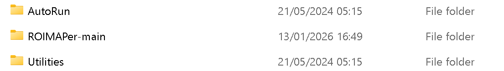
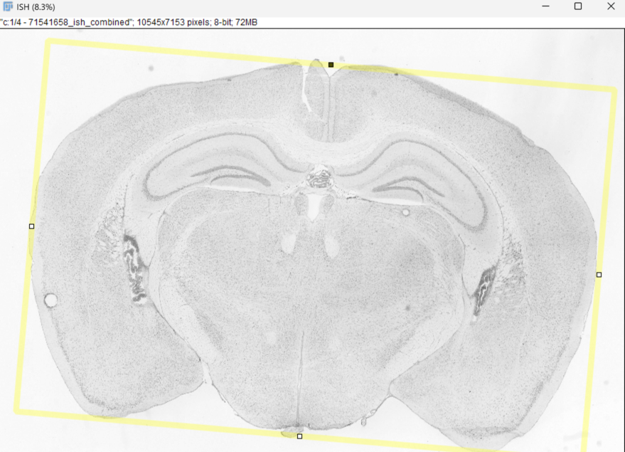
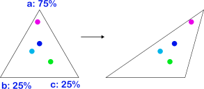

# ROIMAPer

Semi-automatic FIJI macro to map an atlas of ROIs to tissue images. 
Comes with the 2017 version of the adult mouse Allen Brain Atlas CCFv3 and version 4 of the Waxholm Space Atlas of the Sprague Dawley Rat Brain.

Created by Julian Rodefeld in the Ciernia lab, University of British Columbia, Vancouver, in Sep 2025.

### Installation

Either download all files from github, or clone the repository using **git clone https://github.com/ciernialab/ROIMAPer**

Place the ROIMAPer-main folder in scripts/plugins/ in your FIJI folder (you can find the fiji folder under File>Show Folder>ImageJ in FIJI)

The scripts in ROIMAPerUtilities are not necessary for ROI mapping. They were used to create the atlas and can be used to create ROIs outside of the main program.

### Image Prerequisits 

1. Know your images
    2. Do they have multiple slices?
    3. Which slice do you want to analyze?
    4.  Which channel corresponds to which label/stain/wavelength?

3. Ideally: save your images as one-slice TIFF files. This ensures high image quality. 

4. When working with .czi files from Zen (Zeiss):
    - Every scene gets saved multiple times at different resolutions (often times 6 duplicates in total).
    - To make processing easier, batch convert your scenes to tiffs instead.
    - Czi files can currently not be a Z-stack.

### Mapping the ROIs 

1. Start the ROIMAPer plugin and select the .tif file that corresponds to your atlas (e.g. "aba_v3-Coronal_halfbrain.tif" if you want to work with a coronal slice of one hemisphere of a mouse-brain).

2. Choose the directory in which the images that you wish to map are located. 

3. Specify the first and the last image of your analysis; you can exclude images between those in the next window. After this step, the metadata of every image is scanned. This might take a while for large/many files.

4. Select the settings for this run

    1. Specify, whether or not to use the same slice of the ABA for each image or not.
    2. Do you want a combined result, meaning all ROIs and all channels of one image saved within one file. 
    3. There is a rudimentary algorithm that automatically detects the tissue, called "automatic bounding box". 
    4. If you are worried about having to terminate the work midway, you can save after every image instead of saving all images at the end.
    5. Output type as either:
       1. Individual: Output a file for every combination of region and channel
       2. Combined: Output only one file per input image, with every region and channel combined
       3. Both: Do both
    6. Do you want to use blind mode? Image order will be randomized and image names will not be displayed (instead, every file will temporarily be named **pseudoname**, so be sure that that is not the name of your input images. Output names will be normal, though. 
    7. Do you want to select individual slices for each image, or can the first slice be used in each image?

9. Reference, which regions you want to map to your images. A list of available regions will open. Enter the value in the "acronym" column, seperated by commas, and press OK. The first time new ROIs are used in a new atlas they are created from the reference images, depending on the region this might take a while.
    1. If you choose, you can select to only save part of these regions. To do that, click the corresponding checkmark. A second window will pop up. Delete all the region acronyms that you do not want to save. This can be useful to see all brain regions, but only save some, when you need the context of brain regions for correct placement, but do not want to clutter the output.

7. Channels: first add any custom channel names to the pop-up (separated by commas), then select which channel in your images belongs to which label. Select which of the channels is staining all of your tissue (usually DAPI) as the "control channel". If you want to create a result for the control channel, too, check the corresponding chechmark The channel order needs to be consistent between all images.

8. Now each image will open one by one. Create a **rotated rectangle** (called the bounding box) that sits flush with the image and contains the brain as straight as possible. Compare your image with the atlas overview and enter the **atlas number** that you believe best represents you image. Press OK. (Image obtained from the allen institute at [mouse.brain-map.org, experiment: 71670728](https://mouse.brain-map.org/experiment/show/71670728)
   
   
10. You are now in the **Modify** menu 

    1. Rotate and flip the ROIs if necessary.

    2. The ROIs will be set onto the tissue, adjust them manually (by double clicking the ROI or clicking the label in the ROI manager), if the location or scale is off.

    3. If your tissue does not match perfectly with the atlas, you can perform a **"mesh transform"**. This is best for stretching and squishing the regions of interest.
        1. Here, you are prompted to create a collection of points on the brain, so-called mesh-nodes. Place these around brain regions that you want to stretch/squish. Also place nodes around brain regions that you do not want to be affected by the stretching/squishing that is happening in other places of the brain.
        2. Four points outside the bounding box are created automatically, you might have to add more mesh points outside the bounding box, if you regions are close to the edge of the bounding box. 
        3. After pressing "OK", the nodes create a mesh of triangles and current relative position of all regions in their triangle is calculated.
           
       
        5. You can then move the nodes. After pressing OK this will move/stretch/squish the ROIs relative to their closest nodes. So move the nodes around the ROIs that you want to edit to where the ROI is supposed to be. Do not move nodes around ROIs that you do not want to change. You can repeat this process multiple times.
       
       
    6. Alternatively, you can convert any ROI into an editable point-selection by selecting "change one ROI". After clicking ok, select the ROI you want to edit, click the checkmark and enter a downscaling factor - the default is 10, which means that every 10th point of the original selection is kept/made editable. **Currently only either the individual or the mesh transform works on one image. Do not use both on the same image.**
    7. If you are unhappy with the ROI creation, you can set the Modify-menu choice to "Redo bounding box", which will allow you to start the mapping process over.

11. Do this for all images, and then let the plugin save your ROIs. 
    - They will be stored in a new folder in your output directory, titled with the date and time when you started the mapping process.

If the process is terminated midway your process is not lost. Go to the ImageJ temp directory (in FIJI press File>Show Folder>temp) and search for ROIMAPer. A folder with the roi.zip files for all your images has been created. You can combine those ROIs with your input images, to recover your progress.

---

Thank you for using this plugin. 

The Allen Brain Atlas adult mouse brain was obtained from: [https://download.alleninstitute.org/informatics-archive/current-release/mouse_ccf/annotation/ccf_2017/] at a resolution of 10 µm.  
Allen Reference Atlas – Mouse Brain \[adult mouse\]. Available from [https://atlas.brain-map.org/].

The Waxholm Space Atlas of the Sprague Dawley Rat Brain version 4 was obtained from: [www.nitrc.org](https://www.nitrc.org/projects/whs-sd-atlas).

This plugin was inspired by the FASTMAP plugin by Dylan Terstege from the Epp lab, University of Calgary, published on 12-07-2019 [doi.org/10.1523/ENEURO.0325-21.2022](https://doi.org/10.1523/ENEURO.0325-21.2022), available at [github.com/dterstege/FASTMAP](https://github.com/dterstege/FASTMAP)

Atlas files were compressed using the Bio-Formats plugin suite: Linkert, M., Rueden, C. T., Allan, C., Burel, J.-M., Moore, W., Patterson, A., … Swedlow, J. R. (2010). Metadata matters: access to image data in the real world. Journal of Cell Biology, 189(5), 777–782. [doi.org/10.1083/jcb.201004104](https://doi.org/10.1083/jcb.201004104)

